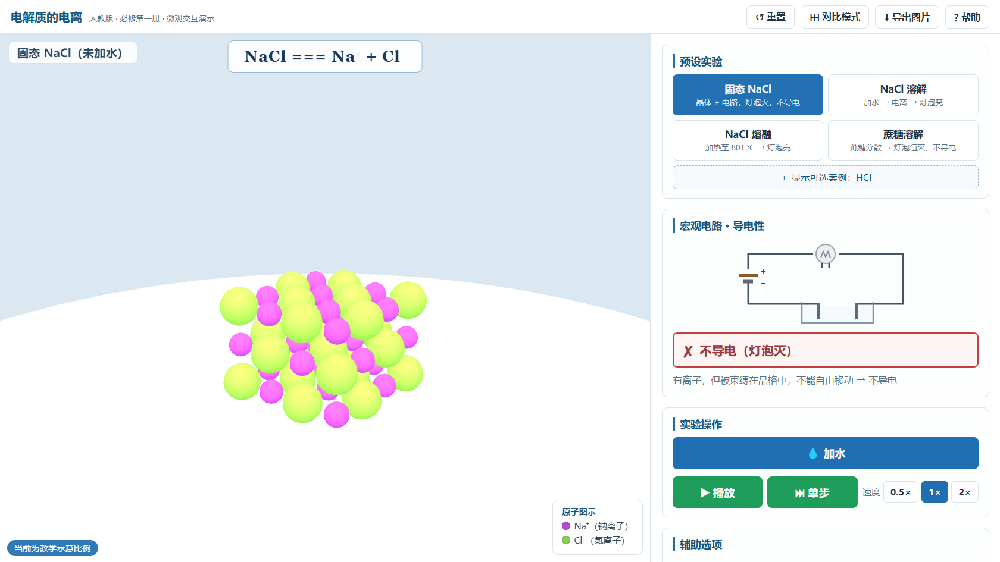

# 电解质的电离 · 交互式微观教学演示

面对人教版高中必修第一册第一章第二节「电解质的电离」的**离线可运行**交互式教学工具。
用 **3D 微观动画 + 2D 宏观电路面板**帮助学生建立「宏观—微观—符号」三重表征，突破
「固态有离子却不导电、溶解/熔融后却导电」这一核心难点。

<p align="center">
  
</p>

<p align="center">
  <a href="https://www.python.org/"></a>
  <a href="LICENSE"></a>
  
  
</p>

## 在线预览

无需下载，直接打开即可体验：

**https://xmmmymm.github.io/electrolyte-ionization/**

> 在线预览需要联网加载页面本身；页面内部不请求任何外部资源。

## 快速开始（离线使用）

1. **克隆或下载本仓库**

   ```bash
   git clone https://github.com/xmmmymm/electrolyte-ionization.git
   ```

   或点击仓库页面右上角 `Code` → `Download ZIP` 后解压。

2. **双击打开 `index.html`**（推荐 Edge / Chrome）

   无需服务器、无需安装依赖、无需联网。Three.js 已随仓库提供，开箱即用。

> 说明：`file://` 协议下双击即可运行。若你删除了 `vendor/three.min.js`，页面仍能打开，
> 但会降级为 2D 静态示意并给出提示（详见 `vendor/README.md`）。

## 目录结构

```
electrolyte-ionization/
├── index.html            页面结构（传统 script 标签，非 ES Module）
├── css/style.css         样式（清爽教学风、响应式、大按钮大字号）
├── js/config.js          全部可调参数（粒子数量、熔点、相机、颜色、比例）
├── js/data.js            物质数据、各阶段文案、方程式、帮助页文案
├── js/app.js             主程序（3D 场景、动画、电路、对比、导出）
├── vendor/three.min.js   本地 Three.js r128（UMD 版，已随仓库提供）
├── vendor/README.md      Three.js 版本说明与升级方法
├── preview.png           README 预览图
├── .github/workflows/    GitHub Pages 自动部署工作流
├── LICENSE               MIT 开源协议
└── README.md
```

## 功能一览

- **预设实验**：固态 NaCl（默认启动，未加水）/ NaCl 溶解 / NaCl 熔融 / 蔗糖溶解 / HCl 溶解（默认隐藏，点击「显示可选案例：HCl」开启）
- **NaCl 溶解三阶段**：①晶体入水·水分子包围（极性取向）→ ②离子脱离晶格 → ③水合自由移动（灯泡亮）
  「播放/暂停」仅控制粒子动画（暂停时粒子冻结，便于观察），阶段推进完全由「单步」控制，
  最后阶段「单步」变为「重放」；速度 0.5× / 1× / 2×
- **微观区域**：以整个 3D 画布作为溶液/熔融区域（无烧杯边界），离子分散与运动清晰可见；
  电离方程式显示在展示区顶部，各原子颜色图示（图例）在展示区右下角
- **NaCl 熔融**：温度滑块 0~1000 ℃，达 801 ℃（真实熔点）晶体熔化、离子自由移动、灯泡亮；
  加热板随温度炽热发红；熔融场景**无水**
- **宏观电路**：2D 面板（电池+导线+灯泡+电极），文字+图标双通道显示导电结论
- **对比模式**：五张卡片（固态/水溶液/熔融/蔗糖/HCl），点击进入对应场景
- **辅助功能**：重置、帮助（操作说明/概念定义/教师备注）、减少动画、真实/示意比例切换、
  查看晶格内部结构、导出图片（PNG）
- **交互视角**：3D 场景支持鼠标拖拽旋转、滚轮缩放、触屏单指旋转/双指捏合

## 科学性要点（实现说明）

| 规则 | 实现方式 |
|---|---|
| NaCl 是离子化合物，溶解是「离子脱离晶格」 | 全部文案集中于 `data.js`，无「分子分裂」表述 |
| r(Na⁺)=102 pm < r(Cl⁻)=181 pm | `config.js` 两种比例模式均保持 Na⁺ 明显小于 Cl⁻ |
| 水分子极性取向 | 氧端朝 Na⁺、氢端朝 Cl⁻（水合与包围晶格时按偶极定向） |
| 水合动态、无固定配位数 | 水分子定时交换，画面与文案均不出现配位数 |
| 熔融电离无需水 | 熔融场景为坩埚+火焰，无水体 |
| 导电判据「自由移动的离子」 | 固态灯泡灭且文案强调「离子被束缚」 |
| 电离不是氧化还原 | 无电子转移的动画、箭头与文案 |
| HCl 共价键断裂 vs NaCl 离子脱离 | 两个场景机制与文案明确区分，HCl 默认隐藏 |
| 蔗糖不电离 | 蔗糖场景无离子，灯泡恒灭 |
| 方程式配平、电荷守恒 | `NaCl === Na⁺ + Cl⁻`、`HCl === H⁺ + Cl⁻`（等号、不标 aq） |

**教学简化（已在帮助页说明）**：粒子数量为示意（数值面板用科学计数法标注真实数量级）；
HCl 写 H⁺ 不写 H₃O⁺；蔗糖不表现氢键；示意比例有角标提示。

## 常用调整

所有参数集中在 `js/config.js`：

- 晶格尺寸 `lattice.sizeX/sizeY/sizeZ`（建议 3~4）
- 水分子数量 `water.count`（120~200，总 3D 粒子数 ≤600）
- 自由离子上限 `freeIon.maxPairs`（≤30 对）
- 离子颜色 `colors.naIon / clIon`
- 温度范围 `temperature.min / max`、熔点 `realData.meltingPointNaCl`（801，真实数据勿改）
- 动画速度档 `animation.speedSteps`

文案与方程式集中在 `js/data.js`。

## 技术约束（已遵守）

- 纯前端离线可用，本地双击可运行；无后端、无账号、无数据记录
- 页面运行时**无 CDN、无外部字体/图标库、无框架**（React/Vue/jQuery 等）
- 无 localStorage / sessionStorage / URL 状态 / fetch
- 传统 `<script>` 标签加载，非 ES Module
- WebGL 不可用时自动降级为极简 2D 静态示意
- 不使用声音，不提供深色模式；刷新后恢复默认状态

## 开发假设

1. 使用 Three.js r128（UMD 版），已随仓库置于 `vendor/`，并保留其 MIT 协议与版权声明
2. 不引入 OrbitControls，旋转/缩放为自行实现
3. 画面粒子数、大小、间距均为教学示意；真实数量级以科学计数法在数值面板表达
4. 电离方程式遵照人教版写法（等号、电荷右上角、不标 aq）
5. 页面不出现「教学目标」字样

## 兼容性

- 优先兼容 Edge，兼顾 Chrome；移动端（窄屏）上下堆叠布局，简单可用
- 低配电脑可开启「减少动画」模式（关闭热运动与平滑过渡）

## 自动部署（GitHub Pages）

仓库已包含 `.github/workflows/pages.yml`：向 `main` 分支推送后会自动把整站发布到 GitHub Pages。

首次启用需要在仓库 **Settings → Pages → Build and deployment → Source** 选择 **GitHub Actions**。

## 第三方资源与许可

| 资源 | 版本 | 协议 |
|---|---|---|
| [Three.js](https://threejs.org/) | r128（`vendor/three.min.js`） | MIT © 2010-2021 three.js authors |

本项目自身代码以 [MIT 协议](LICENSE) 开源。Three.js 遵循其原始 MIT 协议，版权归原作者所有。

## 致谢

- 教材依据：人教版《普通高中教科书·化学·必修第一册》第一章第二节
- 真实数据依据：NaCl 熔点 801 ℃；r(Na⁺) ≈ 102 pm、r(Cl⁻) ≈ 181 pm
